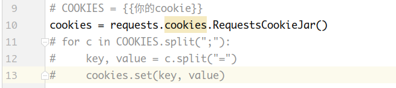
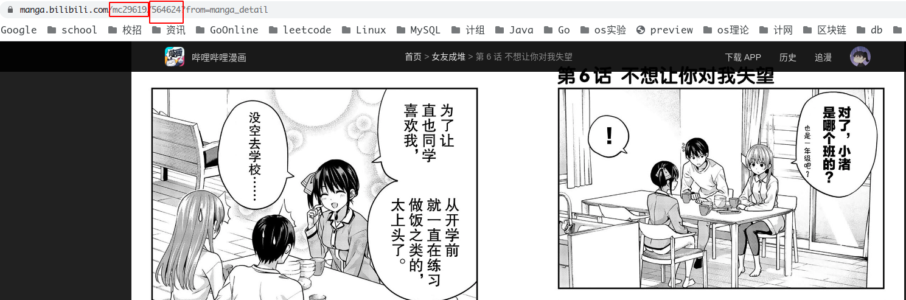
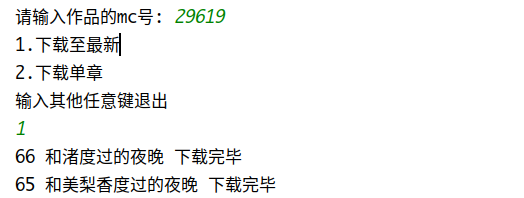

# readme

本程序用于下载b漫的漫画。

## 关于使用

-   如果您要下载的是免费作品，跳过这一步；否则，请在b漫网页版打开任何一章付费章节，复制您的cookie替换到第9行，并把第9/11/12/13行去除注释。

    

-   找到要下载作品的mc号和章节号，以下图为例，mc号是29619，章节号是564624(如果您要下载全本，忽略章节号)。

    

-   python main.py，操作如下：

    

注：本程序仅用于学习交流，侵删。